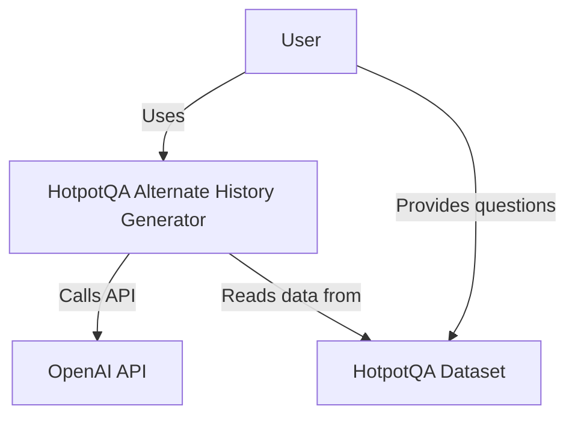
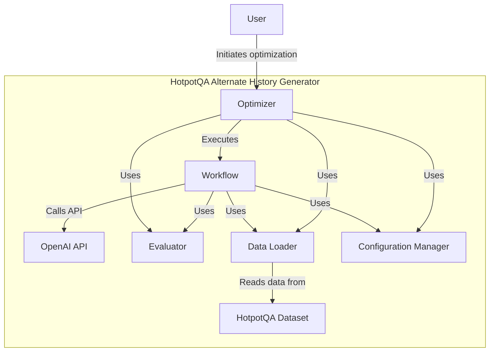
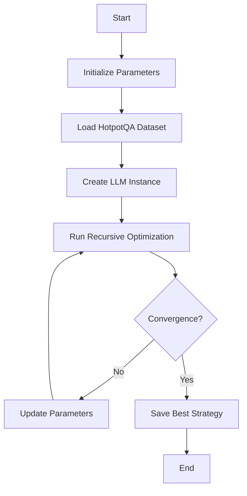
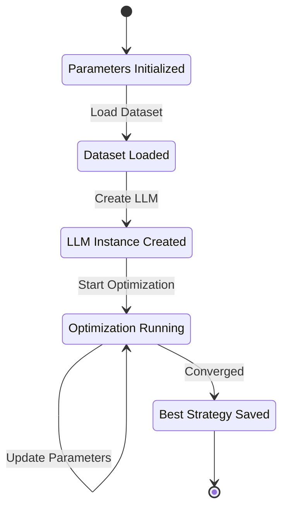
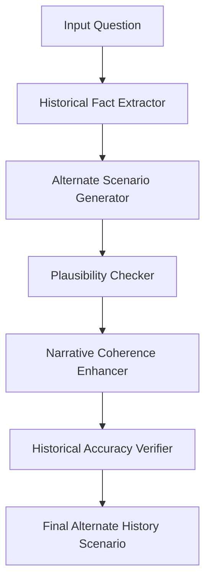
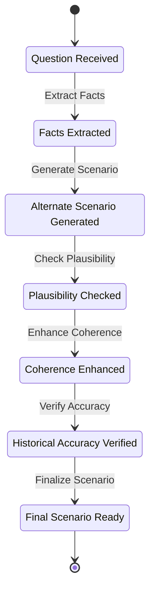
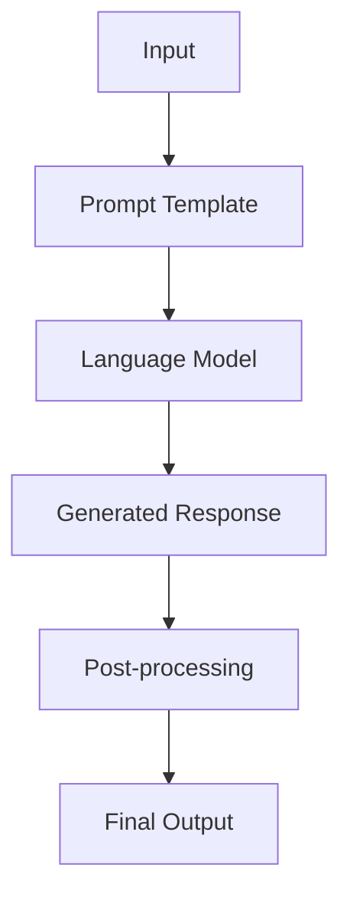
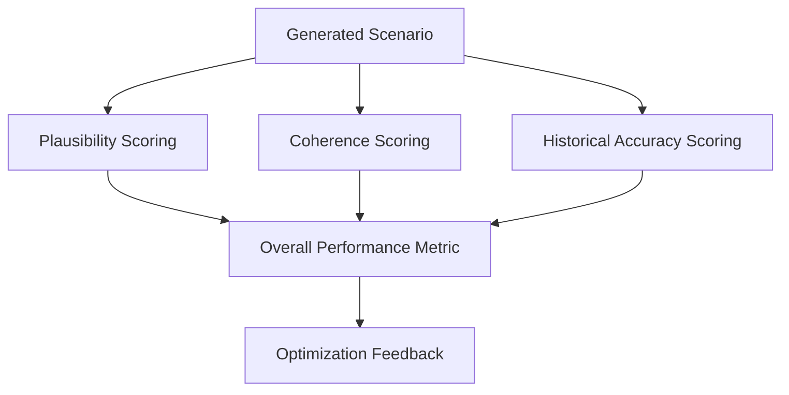
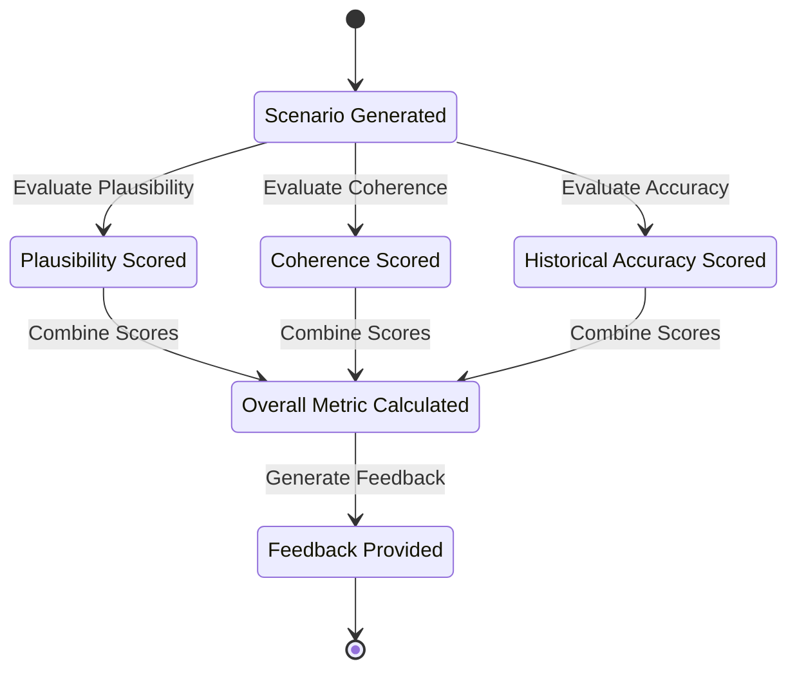

# HotpotQA Alternate History Generator

## Table of Contents
1. [Introduction](#introduction)
2. [System Architecture](#system-architecture)
3. [Key Components](#key-components)
4. [Optimization Process](#optimization-process)
5. [Workflow Execution](#workflow-execution)
6. [Prompt Engineering](#prompt-engineering)
7. [Performance Evaluation](#performance-evaluation)
8. [Scalability and Optimization](#scalability-and-optimization)
9. [Future Improvements](#future-improvements)

## Introduction

The HotpotQA Alternate History Generator is a sophisticated system designed to create plausible alternate historical scenarios based on questions from the HotpotQA dataset. The system employs advanced natural language processing techniques and leverages large language models to generate, evaluate, and optimize alternate history narratives.

## System Architecture

The system follows a modular architecture with several key components working together:

### System Context Diagram

### Container Diagram

## Key Components

### Optimizer

The Optimizer manages the entire optimization process, including:
- Loading configurations
- Initializing workflows
- Running multiple iterations of the optimization process
- Evaluating performance
- Selecting the best strategy

### Workflow

The Workflow executes the alternate history generation pipeline, consisting of:
1. Historical Fact Extractor
2. Alternate Scenario Generator
3. Plausibility Checker
4. Narrative Coherence Enhancer
5. Historical Accuracy Verifier

### Evaluator

The Evaluator assesses the quality of generated scenarios based on multiple criteria, including plausibility, coherence, and historical accuracy.

### Data Loader

The Data Loader is responsible for loading and preprocessing the HotpotQA dataset.

### Configuration Manager

The Configuration Manager loads and manages system configurations, including model settings, API keys, and optimization parameters.

## Optimization Process

The optimization process is a recursive algorithm that iteratively improves the alternate history generation strategy:

1. Initialize parameters
2. Load the HotpotQA dataset
3. Create an LLM instance
4. Run recursive optimization
5. Save the best strategy and results

### Optimization Process Diagram

### Optimization Process Petri Net

The following Petri net diagram illustrates the state changes and transitions in the optimization process:

In this Petri net:
- Places (circles) represent states or conditions.
- Transitions (rectangles) represent actions that change the state.
- Tokens (not visible in this static representation) would move through the net as the process executes.

## Workflow Execution

The workflow execution follows these steps:

1. Extract historical facts from the input question
2. Generate an alternate scenario based on the extracted facts
3. Check the plausibility of the generated scenario
4. Enhance the narrative coherence of the scenario
5. Verify the historical accuracy of the enhanced scenario

### Workflow Execution Diagram

### Workflow Execution Petri Net

The following Petri net diagram represents the workflow execution process:

This Petri net illustrates:
- The sequential flow of the workflow execution.
- Each place (circle) represents a state where the process has produced an intermediate result.
- Each transition (rectangle) represents an action performed by a component of the system.

## Prompt Engineering

The system uses carefully crafted prompts for each step of the workflow, designed to guide the language model in generating appropriate responses for each task.

### Prompt Engineering Flow

## Performance Evaluation

The system evaluates the performance of generated scenarios based on multiple criteria:
- Plausibility score
- Coherence score (number of changes made to improve coherence)
- Historical accuracy score

These scores are combined to produce an overall performance metric, which guides the optimization process.

### Evaluation Process

### Evaluation Process Petri Net

The following Petri net diagram illustrates the evaluation process:

This Petri net shows:
- Parallel evaluation of different aspects of the generated scenario.
- Convergence of individual scores into an overall metric.
- The final step of providing feedback for the optimization process.

## Scalability and Optimization

The system is designed to be scalable and optimizable:
- Uses asynchronous programming for efficient API calls
- Adjustable optimization process parameters
- Support for different language models

## Future Improvements

Potential areas for future improvement include:
1. Implementing more advanced optimization algorithms
2. Incorporating additional external knowledge sources
3. Developing a user interface for easier interaction
4. Implementing caching mechanisms to reduce API calls
5. Adding support for multi-GPU processing

---

This HotpotQA Alternate History Generator leverages advanced NLP techniques and large language models to create plausible alternate historical scenarios. Its modular architecture and optimization capabilities make it a powerful tool for researchers and history enthusiasts alike.